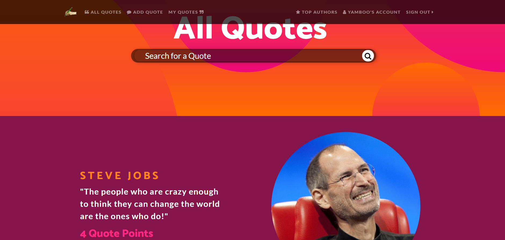
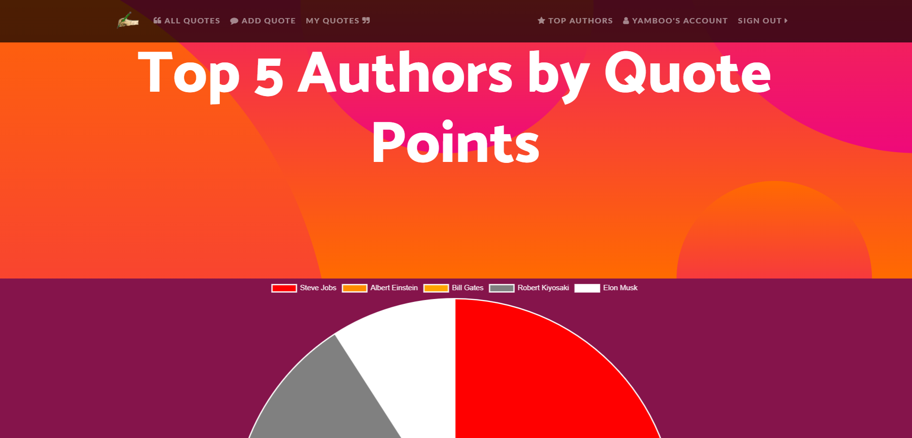

# Quotes Paradise
> Place where you can explore, like and share all your favorite quotes, including all your dad jokes

## Table of contents
* [General info](#general-info)
* [Screenshots](#screenshots)
* [Technologies](#technologies)
* [Setup](#setup)
* [Features](#features)
* [Status](#status)
* [Inspiration](#inspiration)

## General info
This app is created to be presented on the Softuni Django Web Exam from December 2020

## Screenshots

## Technologies
* Python - version 3.8
* Django - version 3.1
* PosgreSQL - version 13.0

## Setup
* Clone the repo -> `git clone https://github.com/nberchev/quotes_paradise.git`
* Create virtual environment -> `python3 -m venv /path/to/new/virtual/environment`
* Install needed packages(including Django) -> `pip install -r requirements.txt`

## Features
List of features ready and TODOs for future development

Ready:
* Authentication system
* Quotes with full CRUD for authenticated users
* Likes(here called Quote Points)
* Search functionality(both by text and by author name)
* Extended Django user with options to edit profile information
* Admin part

To-do list:
* Chat between the users
* Authors(new Model) -> author names also to be clickable
* Comments for the Quotes
* Move likes on the All Quotes page(AJAX) and add Facebook integration
* Pagination on My Quotes page

## Status
In progress

## Inspiration
Project inspired by https://softuni.bg/trainings/3180/python-web-framework-november-2020, based on frontend from http://github.com/startbootstrap/startbootstrap-one-page-wonder
